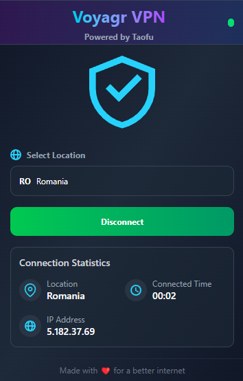
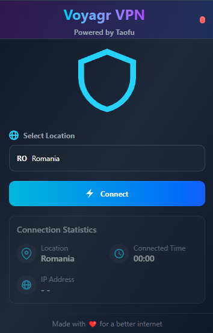

# Voyagr VPN — Decentralized, Plug-and-Play Browser VPN  
**Powered by Taofu**

Lease a secure, low-latency tunnel from the awesome Tensor Private Network in under two seconds — right from your browser.

---

<!-- 📸 Extension UI screenshot -->
 

## Table of Contents
- [Voyagr VPN — Decentralized, Plug-and-Play Browser VPN](#voyagr-vpn--decentralized-plug-and-play-browser-vpn)
  - [Table of Contents](#table-of-contents)
  - [🎯 Elevator Pitch](#-elevator-pitch)
  - [🔍 Problem Statement](#-problem-statement)
    - [TPN to the rescue](#tpn-to-the-rescue)
  - [🚀 Our Solution: Voyagr VPN](#-our-solution-voyagr-vpn)
  - [Technical Implementation](#technical-implementation)
  - [🚧 Roadmap / Next Steps](#-roadmap--next-steps)
  - [Demo](#demo)
  - [📄 License \& Acknowledgements](#-license--acknowledgements)

---

## 🎯 Elevator Pitch
Voyagr VPN builds on TPN’s global miner network to deliver a zero-config, browser-only VPN. No WireGuard installs, no manual configs—just click **Connect**.

---

## 🔍 Problem Statement
1. **Centralized Risk:** Single-vendor VPNs are censorship-prone, and subject to arbitrary decision - making.  
2. **Complex Setup:** WireGuard needs installs + hand-written configs.  
3. **Limited Flexibility:** Hard to swap exit nodes on the fly.

### TPN to the rescue  
TPN incentivizes miners worldwide to run WireGuard-compatible endpoints. You call their REST API to lease diverse, censorship-resistant tunnels with a single HTTP request—no central chokepoint.

## 🚀 Our Solution: Voyagr VPN
We build on TPN’s decentralized backbone to deliver a zero-config, browser-only VPN experience:

Instant Lease via TPN API: Automatically request a WireGuard tunnel from TPN’s miner network.

Auto-Configuring Wireproxy: Parse endpoint + port and spin up a SOCKS5 proxy—no CLI, no downloads.

In-Browser UX: Chrome extension with one-click connect/disconnect, geo-switcher dropdown, and live stats (IP, region, uptime).

---

## Technical Implementation

This repository contains two main components:

- **Dispatcher Service** – A Node.js HTTP API for leasing WireGuard SOCKS5 tunnels via TPN. For detailed installation, configuration, and usage instructions, see `packages/proxy-dispatcher/README.md`.
- **Chrome Extension** – A Manifest V3 extension that connects to the Dispatcher Service’s HTTP API and configures your browser proxy. For build and usage instructions, see `packages/proxy-chrome-extension/README.md`.

## 🚧 Roadmap / Next Steps
- [ ] Auto-scale dispatcher with Kubernetes  
- [ ] Better monitoring of validators
- [ ] Better Tunnel Management (start  / stop / queuing)

---

## Demo

## 📄 License & Acknowledgements
- [MIT License](./LICENSE)  
- Built with ❤️ by Joshua Nazareth
- Thanks to **Taofu** and the **TPN** miner community
